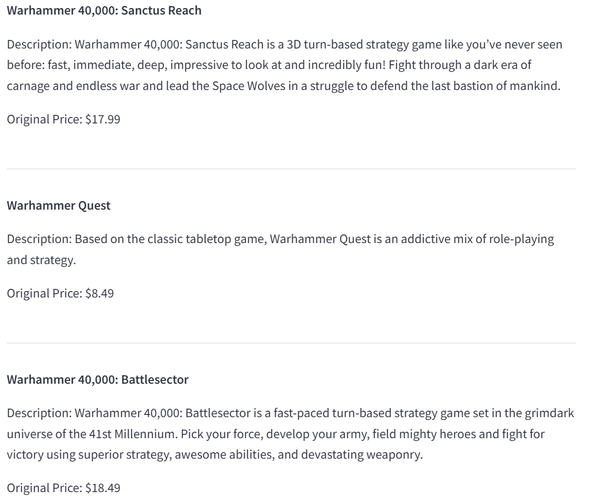

# Steam Game Search Engine

## Introduction
With thousands of games on Steam, it is easy to get lost trying to find the right one. 
Whether you are searching for a game to relax after a long day, dive into a new adventure, or challenge yourself with a competitive experience, our search engine helps you quickly find the perfect game. No more endless scrolling—just smooth, fast, and personalized game discovery!  

Using [Google Cloud Platform (GCP)](https://cloud.google.com/) as our primary platform, we build a game search engine that finds games most similar to a user's search input. We utilize vector search in PostgreSQL and rerank the search results using a cross-encoder. We then make the search engine accessible through an API with a Streamlit interface and deploy them publicly.

## Methods
### Intuition of vector search
Imagine you are in a grocery store trying to find a fruit most similar to an orange. But how to compare an apple to an orange?

First, you assign numerical values to the fruits: a lemon is 1, an orange is 2, and a watermelon is 10. These numbers can represent attributes such as size, price, etc. Next, you use the difference between these numbers as a proxy for the difference between the fruits. This way, compared to a lemon, a watermelon differs more from an orange. In other words, the lemon is more similar to the orange.

In our case, the fruits represent the games in our database, and the orange represents a search input. We use a [sentence transformer](https://sbert.net) (or use [LangChain](https://python.langchain.com/docs) if you like) to convert them into vectors (i.e. lists of numbers) and use [cosine similarity](https://en.wikipedia.org/wiki/Cosine_similarity) to measure the similarities between these vectors. Finally, we find the games most similar to the search input.

### Intuition of reranking with cross-encoder
After retrieving the initial search results, reranking use a more computationally expensive model to better rank them.  

A [cross-encoder](https://www.sbert.net/examples/applications/cross-encoder/README.html) is a model used in the reranking process. Unlike an encoder-decoder model where the search input and initial search results are processed independently, a cross-encoder processes them **together** in a single step to directly evaluate how well they match.   

Back to the grocery store example, instead of assigning values like "lemon = 1" and "orange = 2", you evaluate the match between this "lemon-orange" pair, considering how well a lemon fits with an orange in a more holistic way.

### Intuition of API
An API (Application Programming Interface) is like a factory or a math function. A factory takes specific inputs ($x$) and produces predictable outputs ($y$)—without requiring people to understand the internal workings of the factory.  

Similarly, an API takes a request, processes it according to predefined rules, and returns a response. In our case, the API takes a search input and returns the most similar games.

   

### Intuition of Streamlit
Streamlit is a Python library that simplifies building web applications by writing Python code. It provides an easy and fast way to create visual and interactive interfaces without requiring knowledge of front-end development (like HTML, CSS, or JavaScript).

   

### Intuition of Docker and deploying it on GCP
When you write a program on your computer. Normally, it might not work on someone else's computer because their system could be different (different operating system, different libraries, etc.).  

Docker creates "containers", holding your program and all its dependencies (everything it needs to run like libraries, configurations, etc.) in a consistent way, no matter where it runs. Whether on your computer, a server, or the cloud, the program will always run the same.  

We then deploy Docker on GCP to allow users to access our API publicly.

## Instructions to reproduce
### Datebase setup
1. Create a PostgreSQL database instance in GCP SQL.
2. Create a database called `steam` in GCP SQL in the "Databases" tab.
3. Create a `.env` file at the top of the repo saving database credentials, following the format in [demo.env](demo.env). You can use the default username `postgres` and the password you set. Your host can be found on the GCP SQL "Overview" tab. The default Postgres port is `5432`. Connect to the database `steam`.

### Setup
1. Install packages in [requirements.txt](requirements.txt).
2. Download data from [Kaggle](https://www.kaggle.com/datasets/nikatomashvili/steam-games-dataset), save as [data/steam_data.csv](data/steam_data.csv).
3. Create a SQL table by running [create_table.py](setup/create_table.py).
4. Clean data and use a sentence transformer to create a column with vector embeddings by running [clean_embedding_local.py](setup/clean_embedding_local.py) for about 1.5 hours on my computer (Microsoft Surface Laptop 2), output `data/steam_clean_no_header.csv`.
    - Loading `sentence_transformers` package locally requires `numpy.__version__` < 2 and `keras.__version__` < 3.
    - Alternatively, run [clean_embedding_GCP_Vertex.ipynb](setup/clean_embedding_GCP_Vertex.ipynb) on GCP Vertex AI about 1.5 hours or [clean_embedding_Google_Drive.ipynb](setup/clean_embedding_Google_Drive.ipynb) on Google Drive for about 3.5 hours. Detailed instructions for loading data are in these files.
5. Upload `steam_clean_no_header.csv` into GCP bucket. Load it into `steam` table using the "Import" option in GCP SQL instance's console.
6. Create vector indexes by running [create_vector_indexes.py](setup/create_vector_indexes.py).

Steps 3 to 6 can be combined and automated by running [combined_setup.py](setup/combined_setup.py), but this is not recommended because it is hard to debug.  

### Vector search and reranking with cross-encoder
In [vector_search.py](code/vector_search.py), modify search criteria and run. To add more search criteria:
- Add filter conditions like `AND column_you_choose = $6` after the `results` query, and add corresponding parameters to `results`.
- Assign values to parameters at the top of the program.

### FastAPI
1. Start API server by running [fastapi_app.py](code/fastapi_app.py).
2. Open Swagger UI on a browser by visiting [http://localhost:8080/docs](http://localhost:8080/docs). (Equivalent URLs include [http://127.0.0.1:8000/docs](http://127.0.0.1:8000/docs) and [http://0.0.0.0:8000/docs](http://0.0.0.0:8000/docs), but `localhost` is the most robust.)
3. Submit a request:
    - Find the endpoint (`/search/`) in the Swagger UI.
    - Click **Try it out**.
    - Modify the JSON request.

### Streamlit
1. Start Streamlit app: After running [fastapi_app.py](code/fastapi_app.py), in your terminal, change the working directory to [code](code), run `py -m streamlit run streamlit_app.py` on Windows or `python3 -m streamlit run streamlit_app.py` on MacOS.
2. Open Streamlit UI on a browser by visiting [http://localhost:8501](http://localhost:8501). (Equivalent URLs include [http://127.0.0.1:8501](http://127.0.0.1:8501) and [http://0.0.0.0:8501](http://0.0.0.0:8501), but `localhost` is the most robust.)
3. Submit a request similar to [FastAPI](#fastapi) step 3.

### Docker
1. Install Docker Desktop for [Windows](https://docs.docker.com/docker-for-windows/install/), [MacOS](https://docs.docker.com/docker-for-mac/install/), or [Ubuntu](https://docs.docker.com/install/linux/docker-ce/ubuntu/). Windows users may need to connect it to WSL.
2. Build a Docker image: In your terminal (or Docker Desktop terminal), change the working directory to this repo, run `docker build -t <your-image-name> .`. From now on, replace `<your-image-name>` with the image name you choose.
3. Run a Docker container by running `docker run -p 8080:8080 -p 8501:8501 <your-image-name>`.
4. Same as [FastAPI](#fastapi) or [Streamlit](#streamlit) step 2.
5. Same as [FastAPI](#fastapi) or [Streamlit](#streamlit) step 3.

### Deploy Docker on GCP
1. Install [Google Cloud SDK](https://cloud.google.com/sdk/docs/install) and authenticate (follow the instructions on the website). Authenticate Docker by running `gcloud auth configure-docker` in your terminal.
2. Since Google Cloud Run only supports one port (default `8080`), we deploy FastAPI and Streamlit separately.
    - FastAPI: Copy the contents in [Dockerfile-fastapi-GCP](Dockerfile-fastapi-GCP) to [Dockerfile](Dockerfile).
    - Streamlit: Copy the contents in [Dockerfile-streamlit-GCP](Dockerfile-streamlit-GCP) to [Dockerfile](Dockerfile). In [streamlit_app.py](code/streamlit_app.py), change `8080` to `8000` in `API_URL`.
        - Rationale behind: The default port of FastAPI is `8080`, and we change it to `8000` in [streamlit.sh](streamlit.sh). The default port of Streamlit is `8501`, and we change it to `8080` in [streamlit.sh](streamlit.sh) to match the default port of Google Cloud Run. 
3. Redo [Docker](#docker) step 2. ARM64 users run `docker buildx build --platform linux/amd64 -t <your-image-name> .` instead because Google Cloud Run does not support ARM64. You can use a new image name to distinguish from the local one. 
3. Push the Docker image to Google Cloud Registry by running `docker tag <your-image-name> gcr.io/<your-project-id>/<your-image-name>` and `docker push gcr.io/<your-project-id>/<your-image-name>`. From now on, replace `<your-project-id>` with your GCP project ID.
4. Deploy the image on Google Cloud Run by running `gcloud run deploy <your-service-name> --image gcr.io/<your-project-id>/<your-image-name> --platform managed --memory=3Gi`. Replace `<your-service-name>` with the service name you choose. You will be prompted for region and to **allow unauthenticated invocations**: respond `y` if you want public access, and `n` to limit IP access to resources in the same google project.
5. Wait a few moments for the deployment to complete. Once successful, the command line will display the service URL.
6. Similar to [FastAPI](#fastapi) step 2, take the sercive URL and add `/docs` after it.
7. Same as [FastAPI](#fastapi) step 3.

Reference: [Deploy a Dockerized FastAPI App to Google Cloud Platform](https://towardsdatascience.com/deploy-a-dockerized-fastapi-app-to-google-cloud-platform-24f72266c7ef?sk=11195a53615912077030568c8fe81b68) by Edward Krueger and Douglas Franklin.

## Limitations and potential extensions
1. Limited by our computing power, the sentence transformer models we use (`paraphrase-multilingual-MiniLM-L12-v2` and `cross-encoder/ms-marco-MiniLM-L-6-v2`) are quite simple.
2. Data cleaning can be more extensive and sophisticated.
3. Scrape [Steam](https://store.steampowered.com/search/?category1=998&ndl=1&ignore_preferences=1) periodically to update the database.

## Notes
1. When cleaning "Release Date", if a date is not in "Jan 1, 2000" format, set it to NaT/NaN. This includes "Apr 2019", "Apr-2019", "Coming soon", etc.
2. Game name has non-English (e.g. French), non-alphabetical (e.g. Chinese), and non-character (e.g. emoji) words.